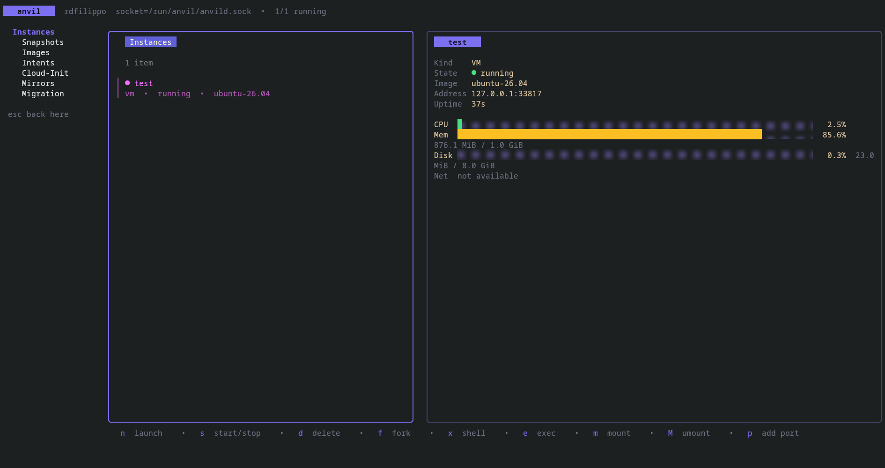
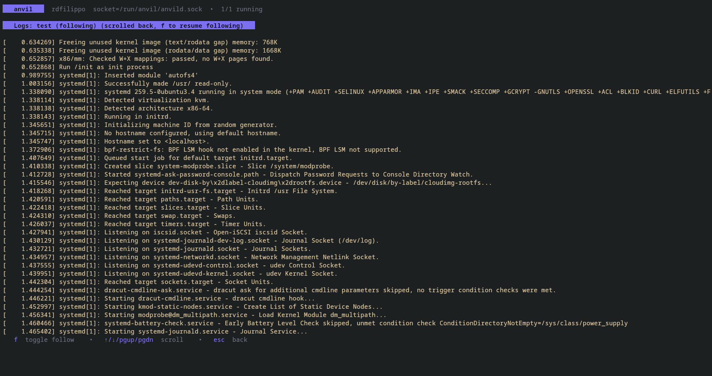
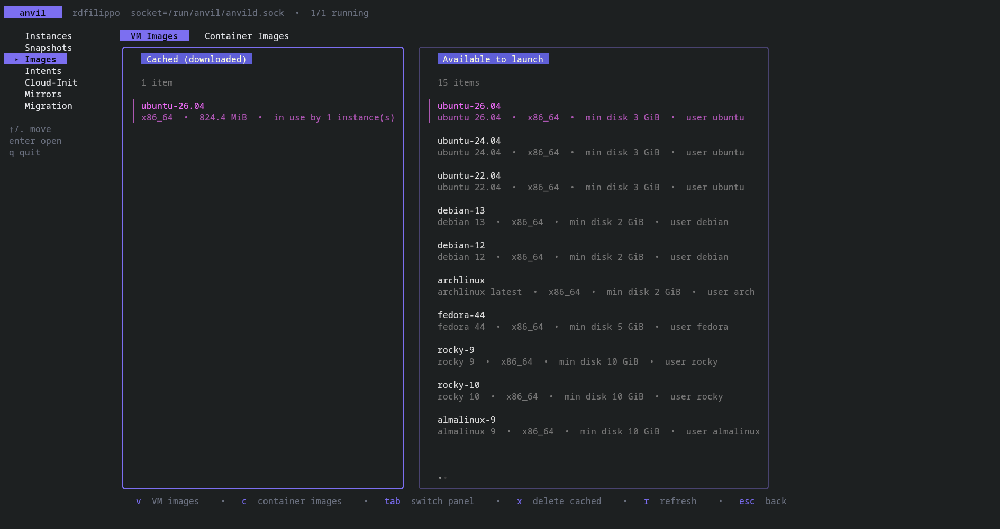
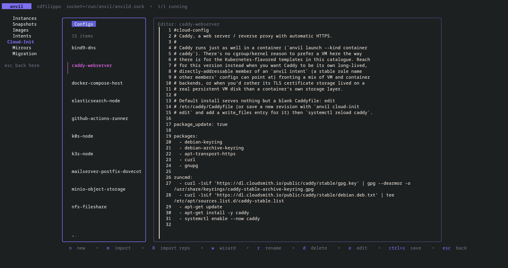

<div align="center">

# ⚒️ Anvil

**A Multipass-style VM & container manager that doesn't stop at VMs, doesn't stop at Ubuntu, and doesn't stop at one machine.**

[](LICENSE.md)
[](go.mod)
[](#)
[](#status--limitations)
[](https://github.com/charmbracelet/bubbletea)
[](api/proto/anvil/v1/anvil.proto)

</div>

---

Anvil spins up cloud-init VMs and Docker containers from the same CLI, the same daemon,
and the same mental model. It's what I wish `multipass` was: not tied to Ubuntu, not VM-only,
and actually able to group stuff together and move it between machines.

No GUI, no login system, no cross-platform abstraction layer to drag around. Just a
daemon, a CLI, a TUI, and real Linux primitives underneath (QEMU/QMP directly, no
libvirt; the real Docker API, no SDK).

## Table of contents

- [Why](#why)
- [Features](#features)
- [Install](#install)
- [Quick start](#quick-start)
- [The TUI](#the-tui)
- [How it's built](#how-its-built)
- [Status & limitations](#status--limitations)
- [Contributing](#contributing)
- [License](#license)

## Why

[Multipass](https://multipass.run) is genuinely solid, and Anvil steals its whole vibe.
But a few things about it kept getting in the way:

- **VMs only.** No containers, so you end up running Multipass *and* Docker side by side
  for no good reason.
- **Ubuntu-first.** Everything about the image story assumes you want Ubuntu.
- **No grouping.** There's no way to say "these three things are actually one app" and
  manage them as a unit.
- **No mobility.** Moving a VM to another machine isn't really a supported idea.
- **A GUI and cross-platform support** that add a lot of surface area if all you actually
  run is Linux.

Anvil is a from-scratch Go rewrite that fixes exactly those five things and nothing else.
It's Linux-only on purpose, that's what makes "just spawn QEMU and talk to the real
Docker API" possible without a platform abstraction layer getting in the way.

## Features

**VMs**, driven straight against `qemu-system-x86_64` over QMP (no libvirt in between):

- 15 base images out of the box: Ubuntu, Debian, Arch, Fedora, Rocky, AlmaLinux, CentOS
  Stream, openSUSE, Alpine (or bring your own via a mirror)
- real cloud-init under the hood, plus a saved cloud-init config library you can write,
  edit, and reuse (`anvil cloud-init`)
- `anvil shell` / `anvil exec` / `anvil transfer` over real SSH, using a keypair Anvil
  manages for you, *zero* flags, *zero* setup
- `anvil mount` shares a host directory into the guest over 9p
- live progress on downloads instead of a silent terminal
- `anvil snapshot` takes point-in-time QCOW2 checkpoints of a VM's disk and restores back
  to them later, live if the VM is running
- `anvil fork` clones a VM into a new instance by copying its disk, keeping the same
  backing image so the fork only stores its own deltas. Safe to run on a running source
  VM: it stays up, untouched, the whole time

**Containers**, talking to Docker's real HTTP API directly (Podman backend is on the
way, tracked separately, see [limitations](#status--limitations)):

- `anvil launch --kind container nginx:alpine` -> auto-pulls, just like `docker run`
- the same `shell`/`exec`/`transfer` commands work here too, backed by `docker
  exec`/`docker cp`
- volumes, env vars, published ports, custom entrypoints, the works
- `anvil image containers list` (and the TUI's Images screen) shows every image cached by
  the engine, separate from VM images, and whether it's actually in use by a container

**Intents**: group VMs and containers together and manage them as one thing:

```
anvil intent create myapp --vm db:postgres:16 --container cache:redis:7
```

Every member gets its own bridge network, a real IP, and can resolve every other member
by name -> no manual networking required. Names are served by `anvild` itself, so a
member added later with `anvil intent add` is resolvable right away by the ones already
running, as `db`, `db.myapp.anvil` or `myapp-db`. See [docs/intent-dns.md](docs/intent-dns.md).

**Migration**: move an instance, or a whole intent, to a different host over plain SSH:

```
anvil migrate myapp --to user@otherhost
```

No daemon-to-daemon trust to set up. If you can already SSH there, you can migrate there.
Copies the disk, brings the network config with it, and only deletes the source once the
target actually confirms it worked.

**A TUI**, because staring at JSON all day gets old:

```
anvil tui
```

Built on [Bubble Tea](https://github.com/charmbracelet/bubbletea). Same daemon, same API,
just easier on the eyes.

**A growing image/template catalogue** you can pull from without waiting for a new
release:

```
anvil mirror add --kind vm --manifest-url <url> extra-images
anvil cloud-init import-repo <url>
```

## Install

### Arch Linux

Clone the repo, then from its root:

```
makepkg -si -p packaging/PKGBUILD
```

This builds two packages, `anvil` (the CLI/TUI) and `anvild` (the daemon), and installs
the daemon as a proper systemd service running under its own unprivileged `anvil` user:
**not root**. `anvild.install` sets up the user, generates a migration keypair, and adds
`anvil` to the `docker` group if it's already installed.

### From source

You'll need Go 1.27+, `protoc`, and `qemu-system-x86_64`,
`qemu-img`, and `xorriso` on your `PATH`.

```
make proto          # regenerate api/gen/anvil/v1 from the .proto file
go build ./...
```

## Quick start

```
sudo mkdir -p /run/anvil /var/lib/anvil /var/cache/anvil
sudo ./anvild &

./anvil launch --kind vm ubuntu-24.04 --name box
./anvil shell box
./anvil list
./anvil stop box
./anvil delete box --purge
```

(Running as root here is just the fast path for trying it out locally, the packaged
version runs the daemon as an unprivileged system user instead, see [Install](#install).)

## The TUI

`anvil tui` gives you a sidebar-driven view over Instances, Images, Intents, Cloud-Init,
Mirrors, and Migration, the exact same gRPC API the CLI uses (`anvil stats <name>` is the
CLI's own window into the same data). Shell/exec sessions hand the real terminal off to
`ssh`/`docker exec` and back, logs stream live, and launch progress redraws in place
instead of scrolling your terminal into oblivion.

Select an instance on the Instances screen and its detail panel shows a live CPU/memory
gauge, disk usage (or I/O rate for a container), network throughput, uptime, and address,
sampled straight from the process itself (`/proc` + the tap device for a VM, Docker's own
stats endpoint for a container), refreshed every couple of seconds, no guest agent
required. From the same screen, `f` forks the selected VM and `E`/`i` export/import it.

### A sneak peek at the TUI






## How it's built

```
anvil (CLI + TUI, one binary)  ──gRPC over a unix socket──▶  anvild (daemon)
                                                                  │
                                                                  ├─ QEMU processes, driven over QMP
                                                                  ├─ Docker's real HTTP API
                                                                  ├─ bbolt (instances / intents / images / mirrors)
                                                                  └─ SSH, for migration to another anvild
```

The daemon owns every bit of business logic. The CLI and TUI are dumb clients: build a
request, call the daemon, print the reply. Access control is just being in the `anvil`
Unix group and being able to reach the socket, *no* accounts, *no* portal, *no* password.

Everything the daemon does across hosts (migration) goes over plain SSH to the target's
own local `anvil` CLI, never daemon-to-daemon gRPC. That means Anvil never has to solve
cross-host trust on its own, whatever SSH access you already have is enough.

```
cmd/anvild/      daemon entrypoint
cmd/anvil/       CLI entrypoint
pkg/client/      thin gRPC client, shared by the CLI and TUI
internal/
  daemon/        gRPC service implementation
  instance/      domain model + the Manager
  vm/            QEMU backend: process management, QMP, cloud-init, image catalog
  container/     Docker backend (Podman lands here too, eventually)
  intent/        grouping, shared bridge networking and DNS per intent
  migrate/       SSH-driven migration
  store/         bbolt-backed registry
  cli/commands/  cobra commands
  tui/           the Bubble Tea app
api/proto/       the gRPC API definition
data/distros/    the built-in VM image catalog
packaging/       PKGBUILD, systemd unit, sysusers/tmpfiles rules
```

## Status & limitations

Anvil is young but everything above is real and working, not vaporware: VMs,
containers, intents, migration, the TUI, and Arch packaging all run today. A few things
aren't there yet:

- **Podman** isn't wired up. `--engine podman` fails cleanly instead of pretending to
  work; Docker is the only engine right now.
- **No mDNS auto-discovery** of other Anvil hosts. `anvil host add` (a saved
  `user@host` alias) covers migration fine without it.
- **No man pages** yet, just `--help` and this README.
- The built-in image catalog's checksums are a work in progress: run
  `scripts/verify-catalog.sh` if you want to double-check before you trust it blindly, or
  point `anvil mirror add` at your own verified manifest instead.

## Contributing

Issues and PRs are welcome. If you're touching daemon logic, keep it in `internal/`
behind the gRPC boundary, the CLI and TUI are meant to stay dumb clients, that's what
keeps them in sync with each other for free.

## License

[Apache 2.0](LICENSE.md).
